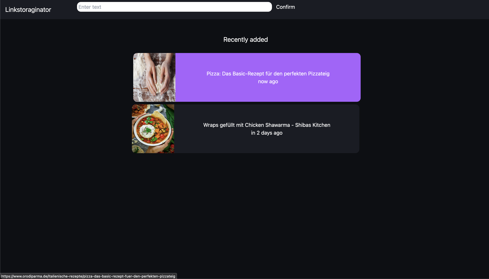

## Vercise | Linkstoraginator
The [Linkstoraginator] is designed to help you comfortably browse through the black hole of your browser bookmark folders, which is mostly a cluttered graveyard of outdated links you probably forgot you saved.

### Use Cases
1. **Revamping Your Diet**: Instead of piling up more bookmarks when you're looking to swap out chips for kale, use Linkstoraginator to curate a list of healthy recipes. Open the website, and manage everything there—no new bookmark folders needed.

2. **Research and Curiosity**: Got a burning question or a topic you're dying to dive into? Just throw your links into the system and let it handle the mess.

### Future Outlook
Like every "cool" product in 2024, it’s crucial to sprinkle some AI magic into the mix. Here are some futuristic ideas (but hey, if you want something specific, just fork us and fire up a pull request!):

1. Add AI (because, why not?)
2. More AI (you can never have enough)
3. Use an LLM to categorize and sort link content.
4. Auto-create content categories based on when you insert links.
5. Integrate a wayback machine feature to view archived versions of websites.
6. Enable search functionality using LLM to sift through links and answer your pressing queries with ease.

### Tech Stack

- **Rust & Rocket**: Because we like our software like we like our metal—strong and reliable.
- **HTMX & TailwindCSS**: For making things pretty without losing your mind.
- **MongoDB**: To store all your digital hoarding efficiently.